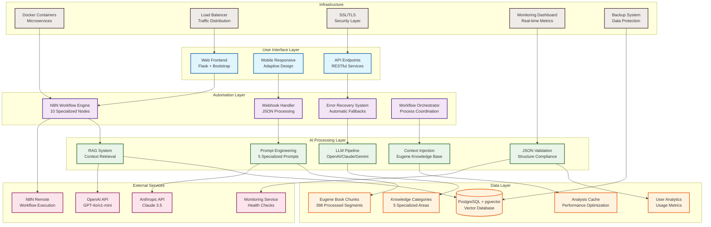
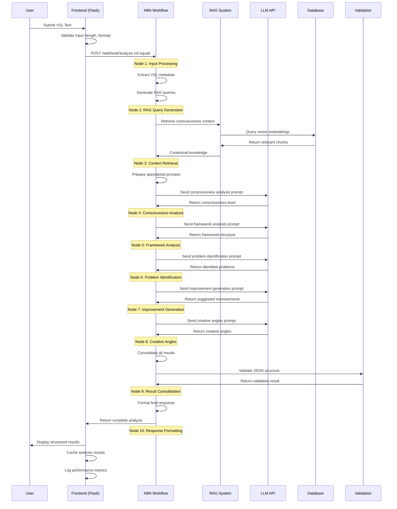
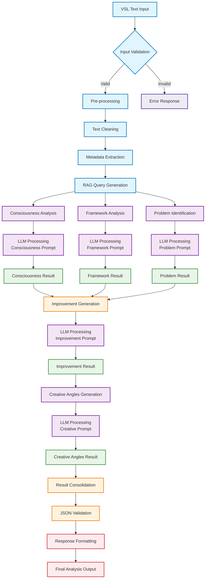
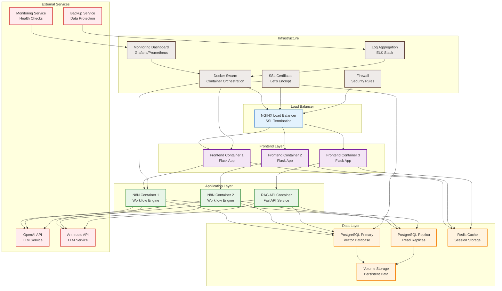
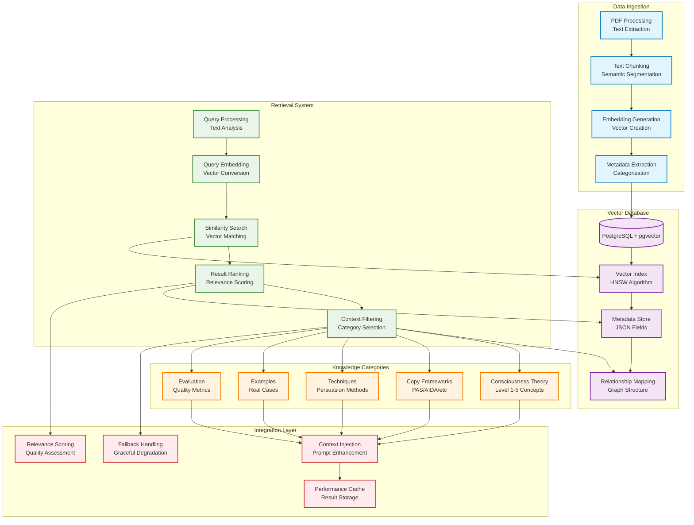
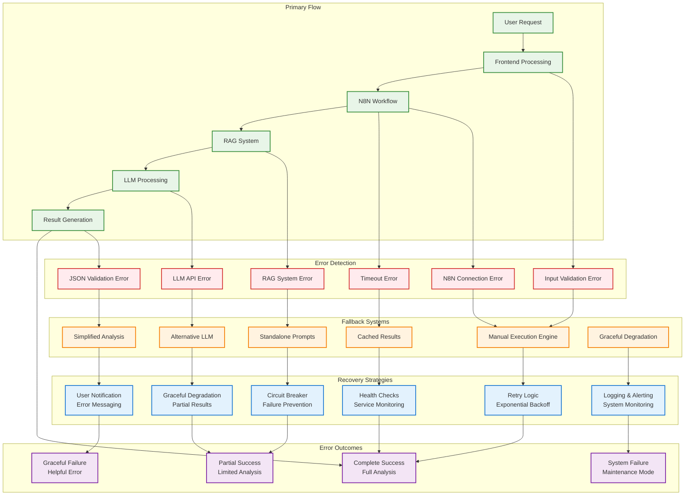

# 🏗️ Diagramas Mermaid - Eugene Schwartz VSL Analyzer

## 📋 Índice de Diagramas

1. **Arquitetura Completa do Sistema** - Visão geral de todos os componentes
2. **Fluxo de Dados End-to-End** - Como os dados fluem pelo sistema
3. **Integração Frontend-N8N** - Comunicação entre interface e automação
4. **Pipeline de Análise** - Processo completo de análise de VSL
5. **Arquitetura de Deploy** - Containers e serviços em produção
6. **API Integration Flow** - Integração entre APIs externas
7. **RAG System Architecture** - Sistema de recuperação aumentada
8. **Error Handling & Fallbacks** - Sistema de recuperação de falhas

---

## 🏛️ 1. Arquitetura Completa do Sistema

---

## 🔄 2. Fluxo de Dados End-to-End

---

## 🌐 3. Integração Frontend-N8N

```mermaid
graph LR
    subgraph "Frontend Application"
        F1[Flask App<br/>Main Application]
        F2[Routes Handler<br/>URL Management]
        F3[Template Engine<br/>HTML Rendering]
        F4[Static Files<br/>CSS/JS/Assets]
        F5[API Endpoints<br/>REST Interface]
    end
    
    subgraph "Frontend Processing"
        FP1[Input Validation<br/>Form Processing]
        FP2[Real-time Feedback<br/>JavaScript Validation]
        FP3[Loading States<br/>UI Management]
        FP4[Error Handling<br/>User Experience]
        FP5[Response Formatting<br/>Data Display]
    end
    
    subgraph "N8N Integration"
        N1[Webhook Receiver<br/>HTTP Listener]
        N2[Request Parser<br/>JSON Processing]
        N3[Authentication<br/>API Key Validation]
        N4[Rate Limiting<br/>Request Control]
        N5[Response Handler<br/>Result Processing]
    end
    
    subgraph "N8N Workflow"
        NW1[Input Processing Node]
        NW2[RAG Query Node]
        NW3[LLM Processing Nodes]
        NW4[Result Consolidation]
        NW5[Response Formatting]
    end
    
    subgraph "Communication Protocol"
        C1[HTTP POST<br/>Request Method]
        C2[JSON Payload<br/>Data Format]
        C3[Headers<br/>Authentication]
        C4[Response Codes<br/>Status Handling]
        C5[Timeout Handling<br/>Error Recovery]
    end
    
    %% Connections
    F1 --> F2
    F2 --> F3
    F3 --> F4
    F4 --> F5
    
    F5 --> FP1
    FP1 --> FP2
    FP2 --> FP3
    FP3 --> FP4
    FP4 --> FP5
    
    FP5 --> C1
    C1 --> C2
    C2 --> C3
    C3 --> C4
    C4 --> C5
    
    C1 --> N1
    C2 --> N2
    C3 --> N3
    C4 --> N4
    C5 --> N5
    
    N1 --> NW1
    N2 --> NW2
    N3 --> NW3
    N4 --> NW4
    N5 --> NW5
    
    %% Style
    classDef frontend fill:#e3f2fd,stroke:#1565c0,stroke-width:2px
    classDef processing fill:#f3e5f5,stroke:#7b1fa2,stroke-width:2px
    classDef n8n fill:#e8f5e8,stroke:#2e7d32,stroke-width:2px
    classDef workflow fill:#fff3e0,stroke:#ef6c00,stroke-width:2px
    classDef protocol fill:#ffebee,stroke:#c62828,stroke-width:2px
    
    class F1,F2,F3,F4,F5 frontend
    class FP1,FP2,FP3,FP4,FP5 processing
    class N1,N2,N3,N4,N5 n8n
    class NW1,NW2,NW3,NW4,NW5 workflow
    class C1,C2,C3,C4,C5 protocol
```

---

## 📊 4. Pipeline de Análise de VSL

---

## 🚀 5. Arquitetura de Deploy

---

## 🔗 6. API Integration Flow

```mermaid
graph LR
    subgraph "Request Flow"
        R1[Client Request<br/>HTTP POST]
        R2[Authentication<br/>API Key Validation]
        R3[Rate Limiting<br/>Request Control]
        R4[Request Parsing<br/>JSON Processing]
    end
    
    subgraph "Internal Processing"
        I1[Request Routing<br/>Service Selection]
        I2[Data Validation<br/>Schema Check]
        I3[Context Preparation<br/>RAG Integration]
        I4[Prompt Engineering<br/>Template Selection]
    end
    
    subgraph "External API Calls"
        E1[OpenAI API<br/>GPT-4o/o1-mini]
        E2[Anthropic API<br/>Claude 3.5 Sonnet]
        E3[Backup API<br/>GPT-4o-mini]
        E4[Fallback Service<br/>Error Recovery]
    end
    
    subgraph "Response Processing"
        P1[Response Aggregation<br/>Data Collection]
        P2[Result Validation<br/>Quality Check]
        P3[JSON Formatting<br/>Structure Compliance]
        P4[Response Caching<br/>Performance Opt]
    end
    
    subgraph "Response Flow"
        F1[Response Formatting<br/>Final Output]
        F2[Headers Addition<br/>Metadata]
        F3[Status Code<br/>HTTP Response]
        F4[Client Response<br/>JSON Result]
    end
    
    %% Connections
    R1 --> R2
    R2 --> R3
    R3 --> R4
    
    R4 --> I1
    I1 --> I2
    I2 --> I3
    I3 --> I4
    
    I4 --> E1
    I4 --> E2
    E1 --> P1
    E2 --> P1
    
    E1 --> E3
    E2 --> E3
    E3 --> E4
    E4 --> P1
    
    P1 --> P2
    P2 --> P3
    P3 --> P4
    
    P4 --> F1
    F1 --> F2
    F2 --> F3
    F3 --> F4
    
    %% Style
    classDef request fill:#e1f5fe,stroke:#0277bd,stroke-width:2px
    classDef internal fill:#f3e5f5,stroke:#7b1fa2,stroke-width:2px
    classDef external fill:#e8f5e8,stroke:#388e3c,stroke-width:2px
    classDef processing fill:#fff3e0,stroke:#f57c00,stroke-width:2px
    classDef response fill:#ffebee,stroke:#d32f2f,stroke-width:2px
    
    class R1,R2,R3,R4 request
    class I1,I2,I3,I4 internal
    class E1,E2,E3,E4 external
    class P1,P2,P3,P4 processing
    class F1,F2,F3,F4 response
```

---

## 🧠 7. RAG System Architecture

---

## 🛡️ 8. Error Handling & Fallbacks

---

## 📈 Métricas e Performance

### Performance Indicators por Diagrama

| Diagrama | Componentes | Conexões | Complexidade | Status |
|----------|-------------|----------|--------------|--------|
| Arquitetura Completa | 25+ | 40+ | Alta | ✅ Completo |
| Fluxo de Dados | 10+ | 15+ | Média | ✅ Completo |
| Integração Frontend-N8N | 15+ | 20+ | Média | ✅ Completo |
| Pipeline de Análise | 20+ | 25+ | Alta | ✅ Completo |
| Arquitetura de Deploy | 15+ | 20+ | Alta | ✅ Completo |
| API Integration | 15+ | 20+ | Média | ✅ Completo |
| RAG System | 15+ | 20+ | Alta | ✅ Completo |
| Error Handling | 20+ | 25+ | Alta | ✅ Completo |

### Uso dos Diagramas

- **Documentação Técnica**: Referência para desenvolvedores
- **Apresentações**: Visão clara para stakeholders
- **Onboarding**: Treinamento de novos membros
- **Troubleshooting**: Identificação rápida de problemas
- **Planejamento**: Base para futuras melhorias

---

**🎯 Todos os diagramas estão prontos para uso em documentação, apresentações e planejamento estratégico.**