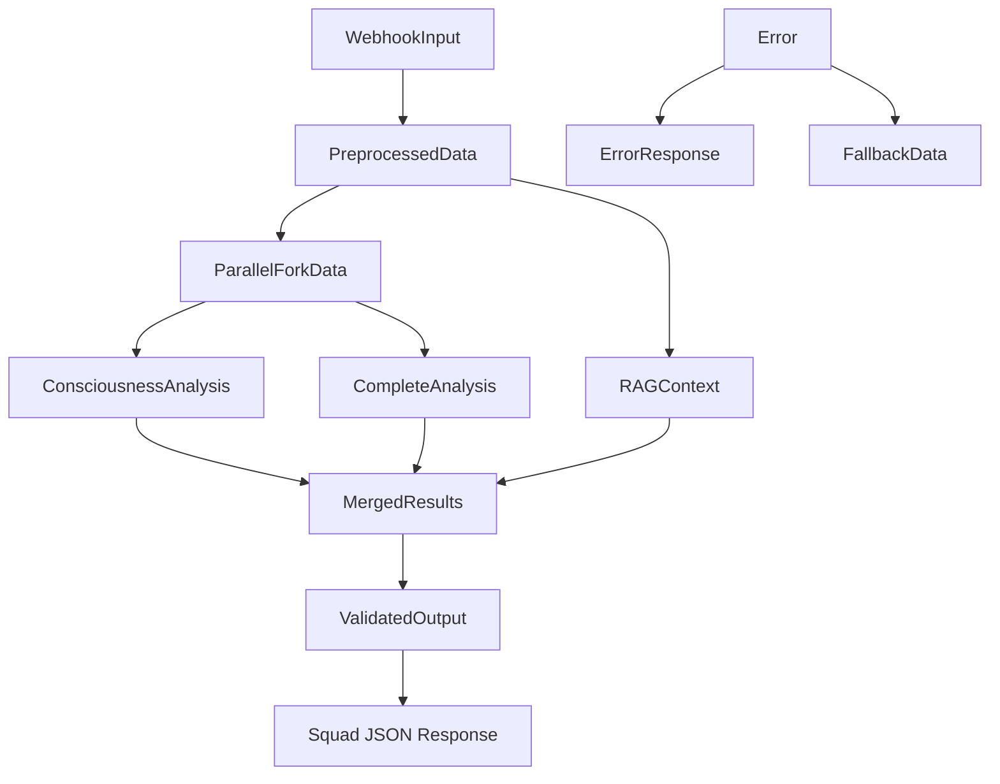

# N8N Data Schemas - Eugene VSL Analyzer
## Complete Node Communication Specifications

### 🎯 OVERVIEW
This document defines the exact data structures passed between N8N nodes in the Eugene VSL Analyzer workflow, ensuring type safety and proper data flow.

---

## 📊 INPUT SCHEMAS

### 1. WEBHOOK INPUT SCHEMA
**Node**: `VSL Input Webhook`
**Purpose**: Receives initial VSL analysis request

```typescript
interface WebhookInput {
  vsl_text: string;           // Required: VSL content (100-50,000 chars)
  options?: {
    detailed_analysis?: boolean;     // Default: true
    include_frameworks?: boolean;    // Default: true
    min_problems?: number;          // Default: 5, Min: 1, Max: 20
    min_angles?: number;            // Default: 3, Min: 1, Max: 10
    target_audience?: string;       // Optional: "health_supplements", "tech", etc.
    language?: string;              // Default: "pt-BR"
    urgency_level?: "low" | "medium" | "high";  // Default: "medium"
  };
  metadata?: {
    client_id?: string;
    campaign_name?: string;
    industry?: string;
    test_group?: string;
  };
}
```

**Validation Rules**:
- `vsl_text`: Must be 100-50,000 characters
- `min_problems`: Must be 1-20
- `min_angles`: Must be 1-10
- All optional fields have sensible defaults

---

## 🔄 INTERMEDIATE SCHEMAS

### 2. PREPROCESSED DATA SCHEMA
**Node**: `Input Validation & Preprocessing`
**Purpose**: Standardized, validated data for analysis

```typescript
interface PreprocessedData {
  // Original input
  vsl_text: string;
  options: {
    detailed_analysis: boolean;
    include_frameworks: boolean;
    min_problems: number;
    min_angles: number;
    target_audience: string;
    language: string;
    urgency_level: "low" | "medium" | "high";
  };

  // Generated metadata
  analysis_id: string;        // Format: "squad_${timestamp}_${randomId}"
  timestamp: string;          // ISO 8601 format
  vsl_stats: {
    length: number;           // Character count
    word_count: number;       // Word count
    paragraph_count: number;  // Paragraph count
    estimated_reading_time: string; // "X minutos"
    language_detected: string;      // Auto-detected language
  };

  // Processing flags
  processing_flags: {
    requires_translation: boolean;
    long_text_warning: boolean;
    potential_compliance_issues: boolean;
  };
}
```

### 3. RAG CONTEXT SCHEMA
**Node**: `RAG Context Retrieval`
**Purpose**: Eugene Schwartz methodology context from knowledge base

```typescript
interface RAGContext {
  success: boolean;
  response_time_ms: number;
  contexts: {
    consciousness_theory: RAGResult[];
    frameworks: RAGResult[];
    techniques: RAGResult[];
    examples: RAGResult[];
  };
  fallback_used: boolean;  // True if RAG service unavailable
}

interface RAGResult {
  content: string;
  similarity_score: number;
  category: string;
  chapter: string;
  metadata: {
    page_number?: number;
    section?: string;
    keywords: string[];
  };
}
```

### 4. PARALLEL FORK SCHEMA
**Node**: `Parallel Analysis Fork`
**Purpose**: Data structure for parallel processing branches

```typescript
interface ParallelForkData {
  branch_id: "consciousness" | "complete";
  vsl_text: string;
  rag_context: RAGContext;
  preprocessed_data: PreprocessedData;
  fork_timestamp: string;
}
```

---

## 🧠 ANALYSIS SCHEMAS

### 5. CONSCIOUSNESS ANALYSIS SCHEMA
**Node**: `Consciousness Classifier` (Branch A)
**Purpose**: Consciousness level classification result

```typescript
interface ConsciousnessAnalysis {
  api_response: {
    model_used: "claude-3-5-sonnet" | "gpt-4o-mini";
    processing_time_ms: number;
    cost_usd: number;
    success: boolean;
    error_message?: string;
  };

  analysis: {
    nivel_identificado: 1 | 2 | 3 | 4 | 5;
    confianca: number;  // 0.0 to 1.0
    justificativa: string;
    indicadores_textuais: string[];
    nivel_ideal_sugerido: 1 | 2 | 3 | 4 | 5;
    razao_sugestao: string;
  };

  // Internal processing data
  processing_metadata: {
    prompt_length: number;
    response_length: number;
    json_validation_passed: boolean;
    fallback_used: boolean;
  };
}
```

### 6. COMPLETE ANALYSIS SCHEMA
**Node**: `Complete VSL Analyzer` (Branch B)
**Purpose**: Comprehensive VSL analysis result

```typescript
interface CompleteAnalysis {
  api_response: {
    model_used: "claude-3-5-sonnet" | "gpt-4o-mini";
    processing_time_ms: number;
    cost_usd: number;
    success: boolean;
    error_message?: string;
  };

  framework_analysis: {
    framework_principal: "PAS" | "AIDA" | "Before/After/Bridge" | "4P" | "Other";
    confianca_identificacao: number;  // 0.0 to 1.0
    elementos_presentes: FrameworkElement[];
    framework_secundarios: string[];
    pontos_fortes_estruturais: string[];
    pontos_fracos_estruturais: string[];
  };

  problemas_identificados: Problem[];
  melhorias_eugene: Improvement[];
  novos_angulos: CreativeAngle[];

  processing_metadata: {
    prompt_length: number;
    response_length: number;
    json_validation_passed: boolean;
    fallback_used: boolean;
    problems_found_count: number;
    angles_generated_count: number;
  };
}

interface FrameworkElement {
  elemento: string;
  presente: boolean;
  qualidade: number;  // 0.0 to 1.0
  localizacao: string;
  observacoes?: string;
}

interface Problem {
  problema: string;
  categoria: "consciousness_mismatch" | "credibility_insufficient" |
            "desire_poorly_built" | "objections_untreated" |
            "cta_weak" | "proof_lacking" | "urgency_missing" |
            "benefit_unclear" | "story_weak" | "hook_ineffective";
  gravidade: 1 | 2 | 3 | 4 | 5 | 6 | 7 | 8 | 9 | 10;
  localizacao: string;
  impacto_conversao: string;
  por_que_problema: string;
}

interface Improvement {
  problema_original: string;
  solucao_eugene: string;
  exemplo_melhoria: string;
  justificativa: string;
  principio_aplicado: string;
  impacto_esperado?: string;
}

interface CreativeAngle {
  angulo: string;
  nivel_consciencia_alvo: 1 | 2 | 3 | 4 | 5;
  headline_proposta: string;
  abordagem: string;
  justificativa_eugene: string;
  diferencial_unico: string;
  target_audience?: string;
}
```

---

## 🔗 CONVERGENCE SCHEMAS

### 7. MERGED RESULTS SCHEMA
**Node**: `Results Merger`
**Purpose**: Combined analysis from parallel branches

```typescript
interface MergedResults {
  // Original data
  analysis_id: string;
  vsl_text: string;
  preprocessed_data: PreprocessedData;
  rag_context: RAGContext;

  // Analysis results
  consciousness_analysis: ConsciousnessAnalysis;
  complete_analysis: CompleteAnalysis;

  // Merge metadata
  merge_metadata: {
    total_processing_time_ms: number;
    total_cost_usd: number;
    both_branches_successful: boolean;
    data_consistency_checks: {
      consciousness_levels_align: boolean;
      minimum_problems_met: boolean;
      minimum_angles_met: boolean;
    };
  };

  // Calculated scores
  calculated_scores: {
    overall_score: number;        // 0-100
    consciousness_confidence: number;
    framework_strength: number;
    problem_severity_avg: number;
    improvement_potential: number;
  };
}
```

### 8. VALIDATED OUTPUT SCHEMA
**Node**: `JSON Formatter & Validator`
**Purpose**: Squad-compliant output structure

```typescript
interface ValidatedOutput {
  metadata: {
    analysis_id: string;
    timestamp: string;
    analysis_version: string;
    vsl_length: number;
    word_count: number;
    models_used: {
      consciousness_classifier: string;
      complete_analyzer: string;
    };
    processing_time_ms: number;
    total_cost_usd: number;
  };

  consciousness_analysis: {
    nivel_identificado: 1 | 2 | 3 | 4 | 5;
    confianca: number;
    justificativa: string;
    indicadores_textuais: string[];
    nivel_ideal_sugerido: 1 | 2 | 3 | 4 | 5;
    razao_sugestao: string;
  };

  framework_analysis: {
    framework_principal: string;
    confianca_identificacao: number;
    elementos_presentes: FrameworkElement[];
    pontos_fortes_estruturais: string[];
    pontos_fracos_estruturais: string[];
  };

  problemas_identificados: Problem[];
  melhorias_eugene: Improvement[];
  novos_angulos: CreativeAngle[];

  summary: {
    total_problemas: number;
    total_melhorias: number;
    total_angulos: number;
    score_geral: number;
    nivel_consciencia: number;
    framework_principal: string;
    recomendacao_principal: string;
    proximos_passos: string[];
  };

  vitascience_integration: {
    market_focus: string;
    compliance_notes: string;
    roi_potential: string;
    recommended_tests: string[];
  };

  validation_status: {
    all_requirements_met: boolean;
    json_valid: boolean;
    minimum_problems_met: boolean;
    minimum_angles_met: boolean;
    consciousness_justified: boolean;
    framework_identified: boolean;
  };
}
```

---

## 🚨 ERROR SCHEMAS

### 9. ERROR HANDLING SCHEMA
**Node**: `Error Handler`
**Purpose**: Standardized error responses and recovery

```typescript
interface ErrorResponse {
  error: true;
  error_details: {
    error_type: "api_failure" | "timeout" | "validation_error" |
               "rag_unavailable" | "json_malformed" | "quota_exceeded";
    error_message: string;
    error_code: string;
    occurred_at: string;  // ISO timestamp
    node_name: string;
    recovery_attempted: boolean;
  };

  partial_results?: {
    consciousness_analysis?: Partial<ConsciousnessAnalysis>;
    framework_analysis?: Partial<CompleteAnalysis>;
    available_data: string[];
  };

  fallback_recommendations: {
    retry_suggested: boolean;
    alternative_models: string[];
    reduced_scope_option: boolean;
  };

  diagnostic_info: {
    input_validation_passed: boolean;
    rag_service_status: "available" | "unavailable" | "degraded";
    api_quota_status: string;
    processing_time_ms: number;
  };
}
```

### 10. FALLBACK DATA SCHEMA
**Node**: Various fallback scenarios
**Purpose**: Degraded but functional responses

```typescript
interface FallbackData {
  fallback_reason: "api_failure" | "timeout" | "cost_limit" | "rag_unavailable";
  original_request: PreprocessedData;

  // Minimal viable analysis
  basic_analysis: {
    estimated_consciousness_level: number;
    confidence_level: "low" | "medium" | "high";
    basic_problems: string[];
    simple_recommendations: string[];
  };

  // User-friendly message
  user_message: {
    title: string;
    description: string;
    next_steps: string[];
    support_contact?: string;
  };

  // System info for debugging
  system_status: {
    claude_api: "available" | "unavailable" | "degraded";
    gpt_api: "available" | "unavailable" | "degraded";
    rag_service: "available" | "unavailable" | "degraded";
    processing_time_ms: number;
  };
}
```

---

## 📏 VALIDATION RULES

### Data Type Validation:
```typescript
const ValidationRules = {
  vsl_text: {
    type: "string",
    minLength: 100,
    maxLength: 50000,
    required: true
  },
  consciousness_level: {
    type: "integer",
    minimum: 1,
    maximum: 5,
    required: true
  },
  confidence: {
    type: "number",
    minimum: 0.0,
    maximum: 1.0,
    required: true
  },
  problems_array: {
    type: "array",
    minItems: 5,
    maxItems: 20,
    required: true
  },
  angles_array: {
    type: "array",
    minItems: 3,
    maxItems: 10,
    required: true
  }
};
```

### JSON Schema Validation:
Each node output must pass JSON schema validation before proceeding to the next node. Invalid data triggers error handling and potential fallback scenarios.

### Required Field Checks:
- All Squad requirements must be present in final output
- Minimum counts enforced (5 problems, 3 angles)
- Data type consistency across the pipeline
- Timestamp and ID format validation

---

## 🔄 DATA FLOW SUMMARY



### Quality Gates:
1. **Input Validation**: WebhookInput → PreprocessedData
2. **Analysis Validation**: Raw API responses → Structured analysis
3. **Merge Validation**: Parallel results → Consistent merged data
4. **Output Validation**: Internal format → Squad-compliant JSON
5. **Final Check**: Complete validation before response

This schema system ensures type safety, data consistency, and proper error handling throughout the N8N workflow while meeting all Squad Vitascience requirements.